# SkillBridge Attendance API

A production-ready REST API for a state-level skilling programme attendance management system with role-based access control and JWT authentication.

## 🚀 Live API URL

**Base URL:** `https://skillbridge-api-6l4p.onrender.com`

**API Documentation (Swagger UI):** `https://skillbridge-api-6l4p.onrender.com/docs`

> **Note:** The free tier on Render spins down after 15 minutes of inactivity. The first request may take 30-60 seconds to wake up.

---

## 📋 Test Accounts (5 Roles)

| Role | Email | Password |
|------|-------|----------|
| **Student** | `student1@test.com` | `password123` |
| **Trainer** | `trainer1@test.com` | `password123` |
| **Institution** | `inst_a@test.com` | `password123` |
| **Programme Manager** | `pm@test.com` | `password123` |
| **Monitoring Officer** | `mo@test.com` | `password123` |

---

## 🛠️ Local Setup Instructions

```bash
# 1. Clone the repository
git clone https://github.com/dk9480/skillbridge-api.git
cd skillbridge-api

# 2. Create virtual environment
python -m venv venv
source venv/bin/activate  # On Windows: venv\Scripts\activate

# 3. Install dependencies
pip install -r requirements.txt

# 4. Create .env file with your database URL
cp .env.example .env
# Edit .env and add your Neon PostgreSQL URL

# 5. Seed the database
python src/seed.py

# 6. Run the API
uvicorn src.main:app --reload

# 7. Open browser at http://localhost:8000/docs
```

## 📡 API Endpoints

### Authentication (No Auth Required)

| Method | Endpoint        | Description                     |
|--------|---------------|---------------------------------|
| POST   | /auth/signup  | Create new user account         |
| POST   | /auth/login   | Login and receive JWT token     |


### Batch Management

| Method | Endpoint                 | Role Required          |
|--------|--------------------------|------------------------|
| POST   | /batches                | Trainer / Institution  |
| POST   | /batches/{id}/invite    | Trainer                |
| POST   | /batches/join           | Student                |

### Session Management

| Method | Endpoint                   | Role Required |
|--------|----------------------------|----------------|
| POST   | /sessions                  | Trainer        |
| GET    | /sessions/{id}/attendance  | Trainer        |


### Attendance

| Method | Endpoint           | Role Required |
|--------|--------------------|----------------|
| POST   | /attendance/mark   | Student        |


### Reports & Summary

| Method | Endpoint                      | Role Required        |
|--------|-------------------------------|----------------------|
| GET    | /batches/{id}/summary         | Institution          |
| GET    | /institutions/{id}/summary    | Programme Manager    |
| GET    | /programme/summary            | Programme Manager    |


### Monitoring (Special Token Required)

| Method | Endpoint                     | Role Required                       |
|--------|------------------------------|-------------------------------------|
| POST   | /auth/monitoring-token       | Monitoring Officer                  |
| GET    | /monitoring/attendance       | Monitoring Officer (special token)  |


## 📸 API Testing Screenshots

### Authentication Tests

| | |
|:---:|:---:|
| 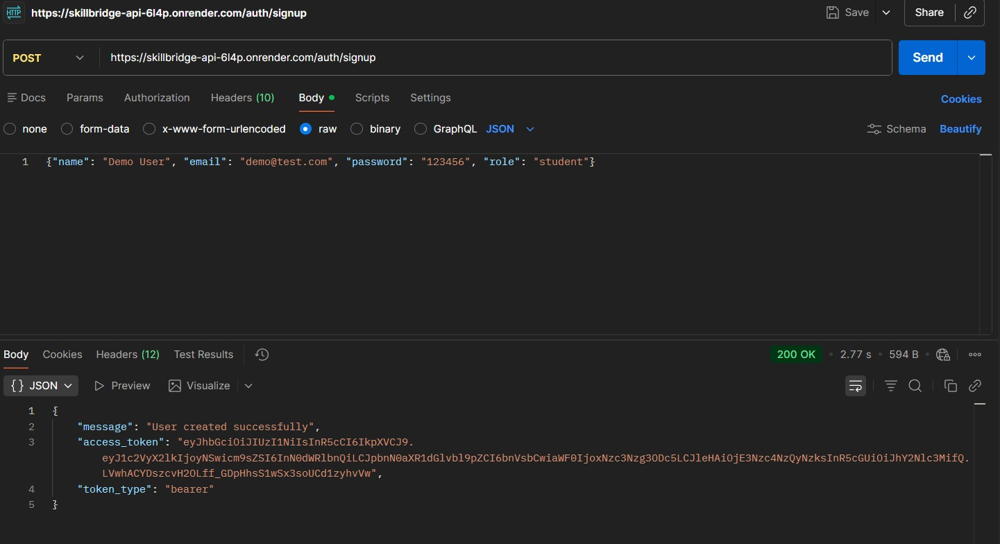 | 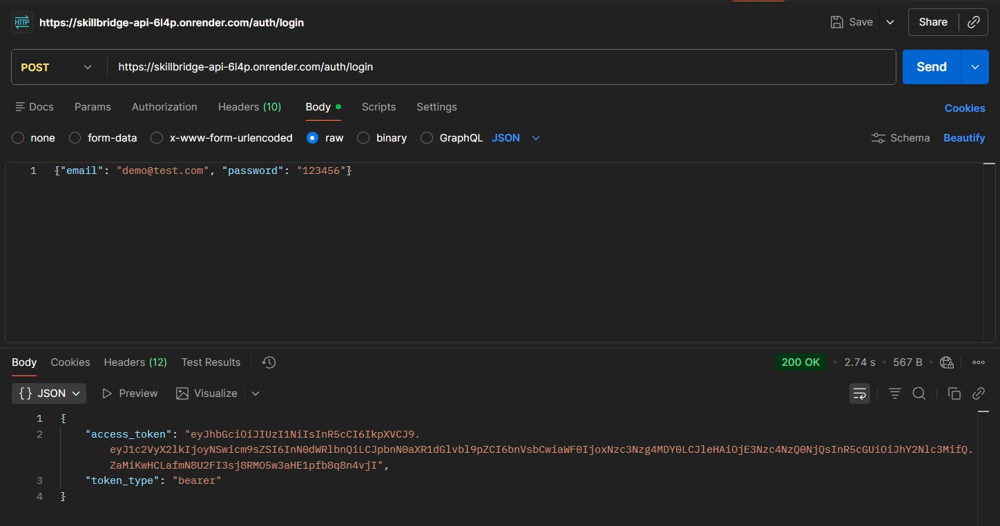 |
| *TEST 1: Signup New User* | *TEST 2: Login New User* |

| | |
|:---:|:---:|
| 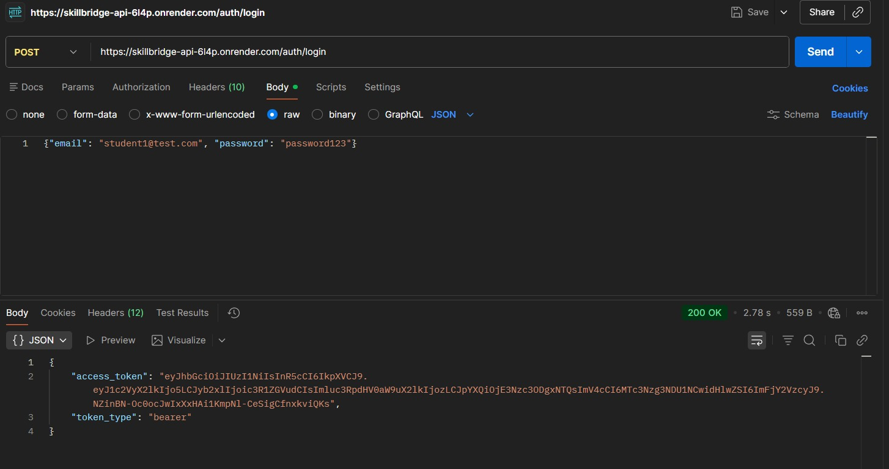 | |
| *TEST 3: Login as Student1* | |

---

### Student Tests

| | |
|:---:|:---:|
| 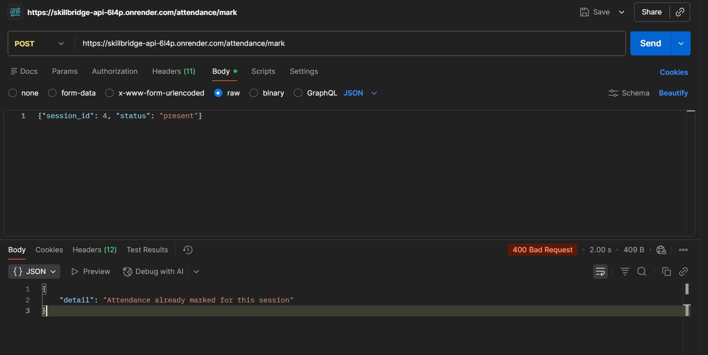 | 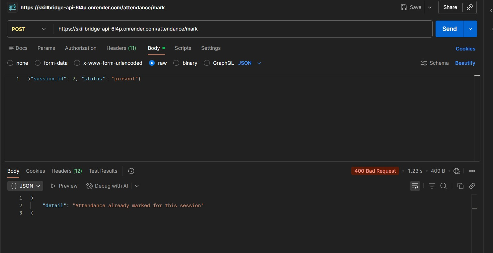 |
| *TEST 4: Mark Attendance (Session 4)* | *TEST 5: Try Different Session (Session 7)* |

| | |
|:---:|:---:|
| 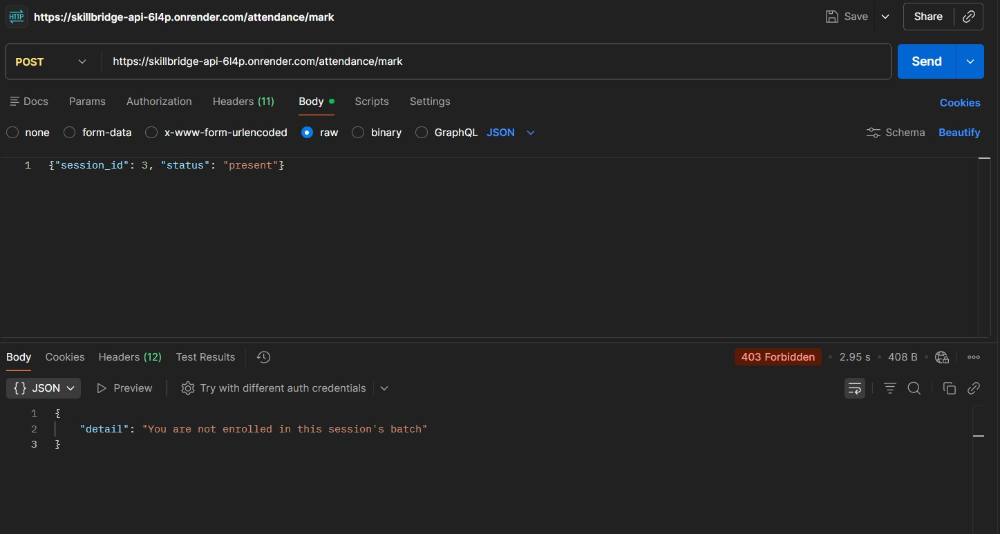 | |
| *TEST 6: Wrong Session - 403 Forbidden* | |

---

### Trainer Tests

| | |
|:---:|:---:|
| 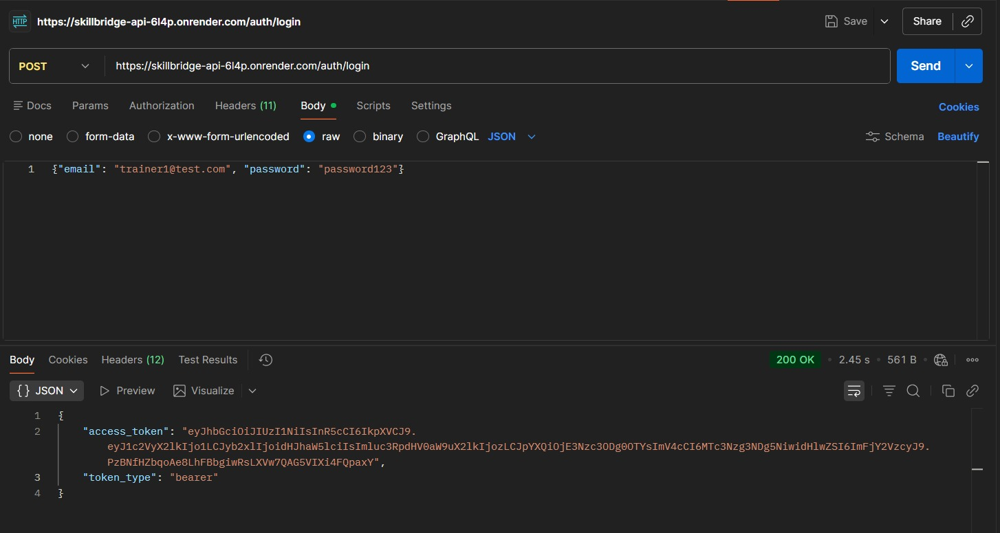 | 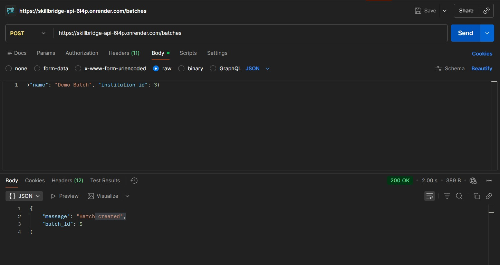 |
| *TEST 7: Login as Trainer1* | *TEST 8: Create Batch* |

| | |
|:---:|:---:|
| 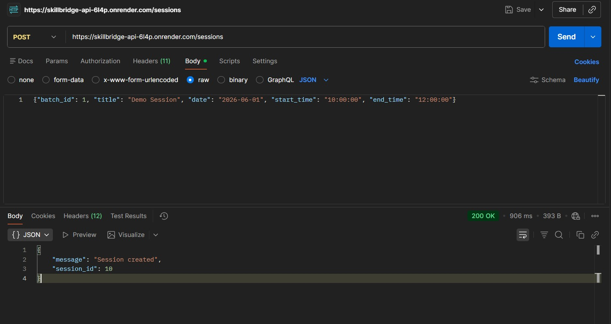 | 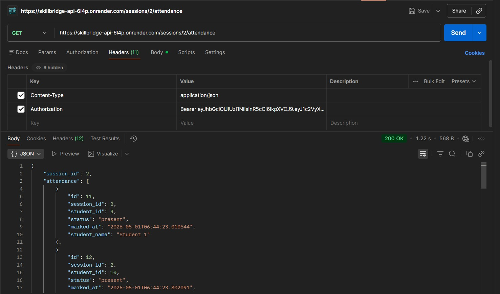 |
| *TEST 9: Create Session* | *TEST 10: Get Session Attendance* |

---

### Institution Tests

| | |
|:---:|:---:|
| 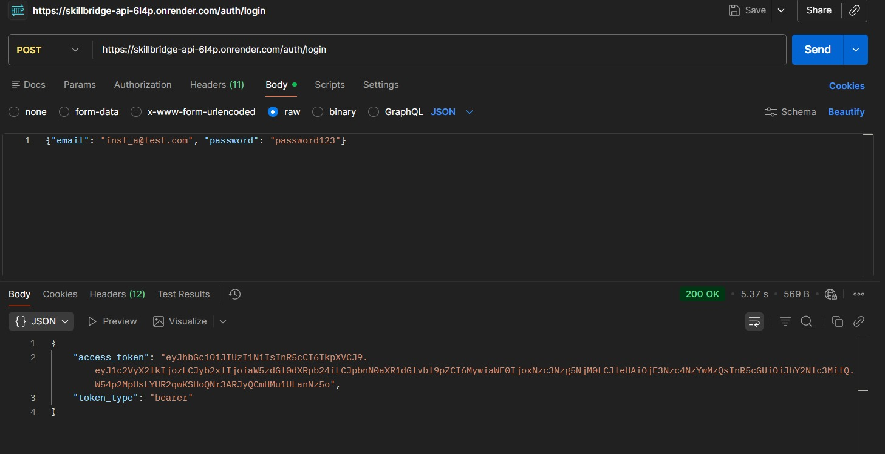 | 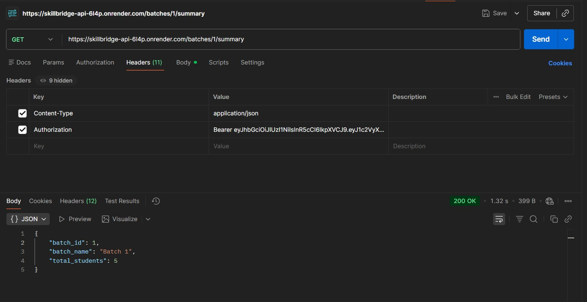 |
| *TEST 11: Login as Institution* | *TEST 12: Batch Summary* |

---

### Programme Manager Tests

| | |
|:---:|:---:|
| 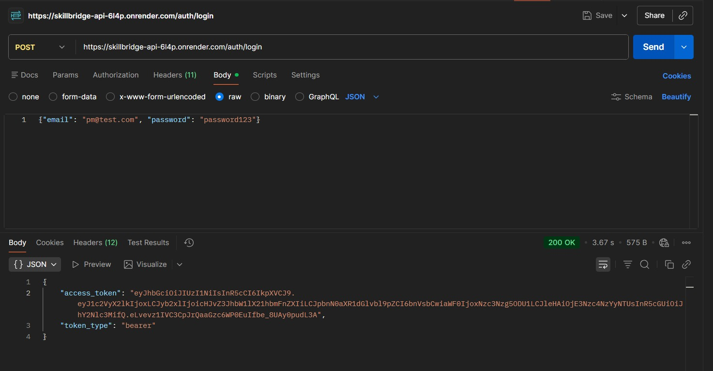 | 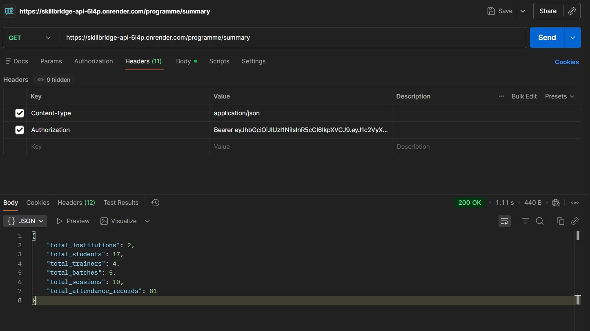 |
| *TEST 13: Login as Programme Manager* | *TEST 14: Programme Summary* |

---

### Monitoring Officer Tests

| | |
|:---:|:---:|
| 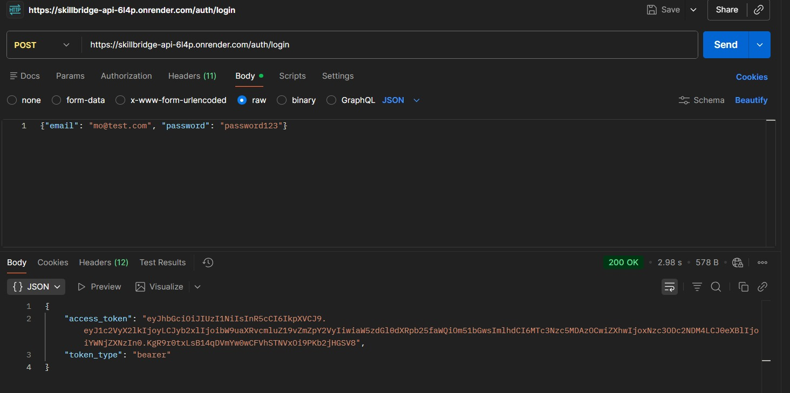 | 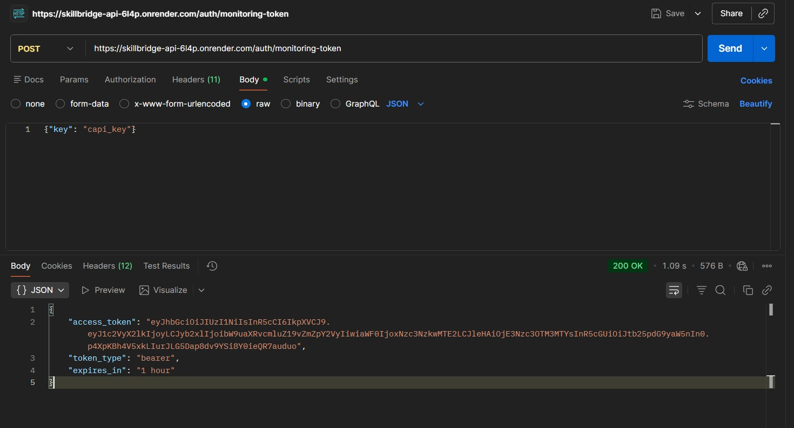 |
| *TEST 15: Login as Monitoring Officer* | *TEST 16: Get Monitoring Token* |

| | |
|:---:|:---:|
| 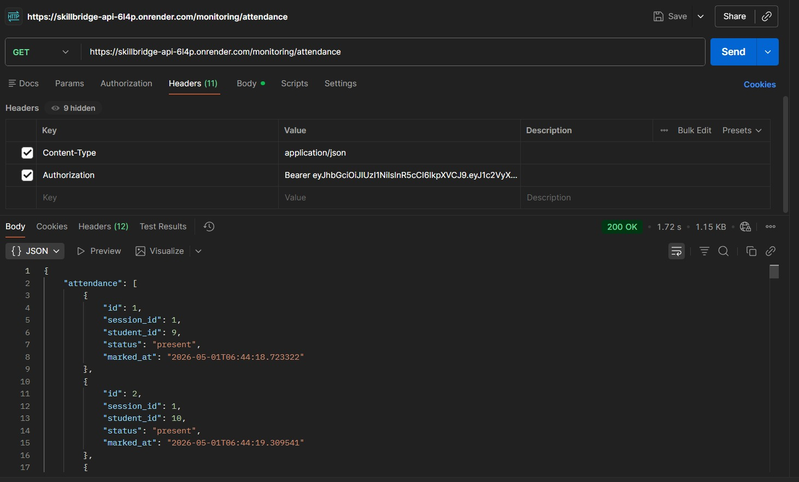 | |
| *TEST 17: Monitoring Attendance with Special Token* | |

---

### Error Handling Tests

| | |
|:---:|:---:|
| 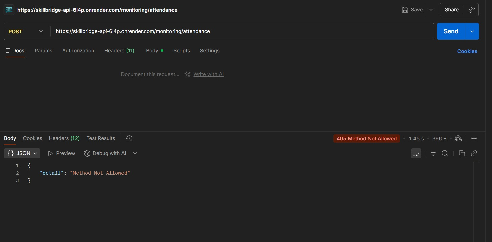 | 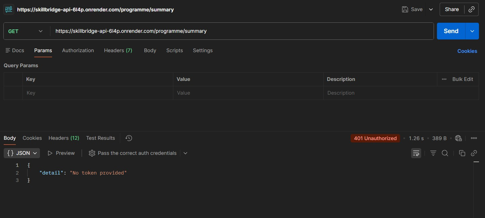 |
| *TEST 18: POST on Monitoring (405)* | *TEST 19: No Token (401)* |


## 📊 Test Results Summary

| # | Test | Status |
|---|------|--------|
| 1 | Signup New User | ✅ |
| 2 | Login New User | ✅ |
| 3 | Login Student | ✅ |
| 4 | Mark Attendance (Session 4) | ✅ |
| 5 | Mark Attendance (Session 7) | ✅ |
| 6 | Wrong Session (403) | ✅ |
| 7 | Login Trainer | ✅ |
| 8 | Create Batch | ✅ |
| 9 | Create Session | ✅ |
| 10 | Get Session Attendance | ✅ |
| 11 | Login Institution | ✅ |
| 12 | Batch Summary | ✅ |
| 13 | Login Programme Manager | ✅ |
| 14 | Programme Summary | ✅ |
| 15 | Login Monitoring Officer | ✅ |
| 16 | Get Monitoring Token | ✅ |
| 17 | Monitoring Attendance | ✅ |
| 18 | POST /monitoring/attendance (405) | ✅ |
| 19 | No Token (401) | ✅ |
| 20 | Wrong Role (403) | ✅ |

## 🔧 Sample curl Commands

### 1. Login as Student
```bash
curl -X POST https://skillbridge-api-6l4p.onrender.com/auth/login \
  -H "Content-Type: application/json" \
  -d '{"email": "student1@test.com", "password": "password123"}'
```

### 2. Mark Attendance
```bash
curl -X POST https://skillbridge-api-6l4p.onrender.com/attendance/mark \
  -H "Content-Type: application/json" \
  -H "Authorization: Bearer YOUR_TOKEN" \
  -d '{"session_id": 4, "status": "present"}'
```

### 3. Create Batch (Trainer)
```bash
curl -X POST https://skillbridge-api-6l4p.onrender.com/batches \
  -H "Content-Type: application/json" \
  -H "Authorization: Bearer TRAINER_TOKEN" \
  -d '{"name": "New Batch", "institution_id": 3}'
```

### 4. Create Session (Trainer)
```bash
curl -X POST https://skillbridge-api-6l4p.onrender.com/sessions \
  -H "Content-Type: application/json" \
  -H "Authorization: Bearer TRAINER_TOKEN" \
  -d '{"batch_id": 1, "title": "Test Session", "date": "2026-06-01", "start_time": "10:00:00", "end_time": "12:00:00"}'
```

### 5. Get Programme Summary (PM)
```bash
curl -X GET https://skillbridge-api-6l4p.onrender.com/programme/summary \
  -H "Authorization: Bearer PM_TOKEN"
```

### 6. Get Monitoring Token (MO)
```bash
curl -X POST https://skillbridge-api-6l4p.onrender.com/auth/monitoring-token \
  -H "Content-Type: application/json" \
  -H "Authorization: Bearer MO_TOKEN" \
  -d '{"key": "capi_key"}'
```

### 7. Error Test - No Token (401)
```bash
curl -X GET https://skillbridge-api-6l4p.onrender.com/programme/summary
```

### 8. Error Test - Wrong Method (405)
```bash
curl -X POST https://skillbridge-api-6l4p.onrender.com/monitoring/attendance
```


## 🗄️ Schema Decisions

### batch_trainers (Many-to-Many)
Allows multiple trainers to be assigned to the same batch and trainers can teach multiple batches.

### batch_invites
Secure token-based enrollment system with 7-day expiration to prevent unauthorized batch joining.

### Dual-Token for Monitoring Officer
Normal JWT: Standard authentication (24 hours)

Monitoring Token: Short-lived (1 hour) with type: "monitoring" claim, scoped only to read attendance

API key validation: Requires capi_key to obtain monitoring token


## 🔐 JWT Token Structure

### Normal Access Token (24 hours)
```json
{
  "user_id": 9,
  "role": "student",
  "institution_id": 3,
  "iat": 1746085600,
  "exp": 1746172000,
  "type": "access"
}
```
### Monitoring Token (1 hour)
```json
{
  "user_id": 2,
  "role": "monitoring_officer",
  "iat": 1746085600,
  "exp": 1746089200,
  "type": "monitoring"
}
```
## ✅ Working Features

✅ JWT Authentication with 24h expiry

✅ Role-based access control (403 on wrong role)

✅ Monitoring Officer dual-token system with API key

✅ All 13 API endpoints

✅ 5+ pytest tests (3 with real database)

✅ PostgreSQL database on Neon

✅ Deployed on Render with environment variables

## 📁 Submission Structure

/submission
├── CONTACT.txt
├── README.md
├── requirements.txt
├── .env.example
├── screenshots/
│   ├── 01-signup.png
│   ├── 02-login-new-user.png
│   ├── 03-login-student.png
│   ├── 04-mark-attendance.png
│   ├── 05-different-session.png
│   ├── 06-wrong-session-403.png
│   ├── 07-login-trainer.png
│   ├── 08-create-batch.png
│   ├── 09-create-session.png
│   ├── 10-get-attendance.png
│   ├── 11-login-institution.png
│   ├── 12-batch-summary.png
│   ├── 13-login-pm.png
│   ├── 14-programme-summary.png
│   ├── 15-login-mo.png
│   ├── 16-monitoring-token.png
│   ├── 17-monitoring-attendance.png
│   ├── 18-405-error.png
│   ├── 19-401-error.png
│   └── 20-403-forbidden.png
├── src/
│   ├── main.py
│   ├── database.py
│   ├── auth.py
│   └── seed.py
└── tests/
    ├── test_auth.py
    ├── test_sessions.py
    ├── test_attendance.py
    ├── test_monitoring.py
    └── test_security.py

    
